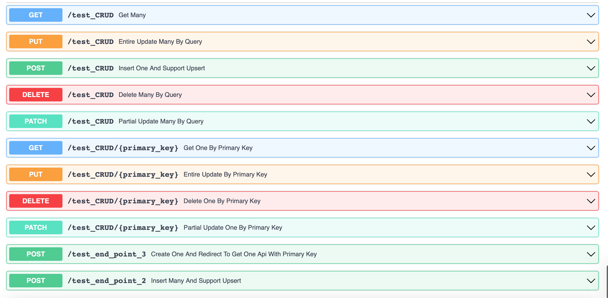
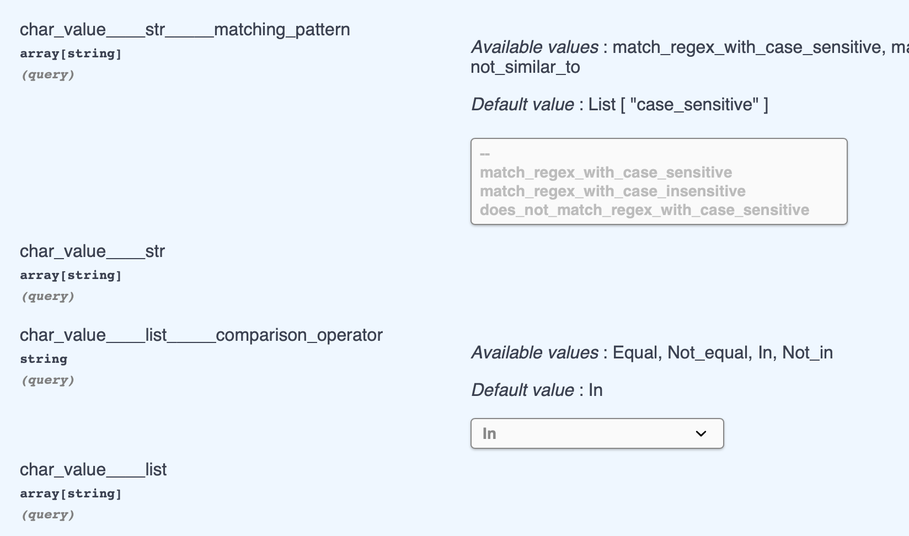
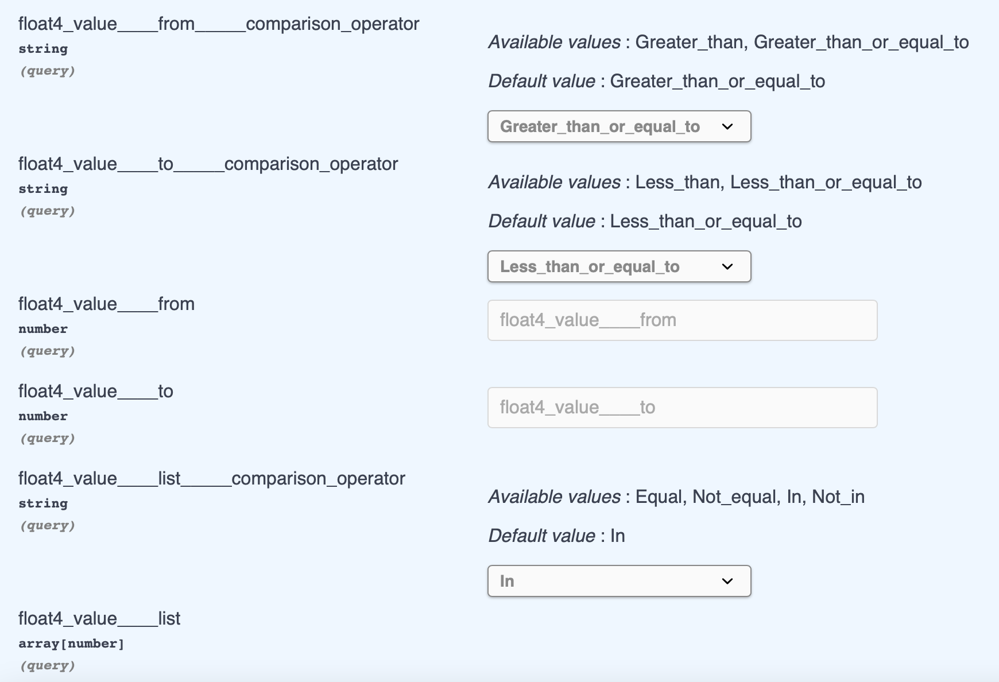
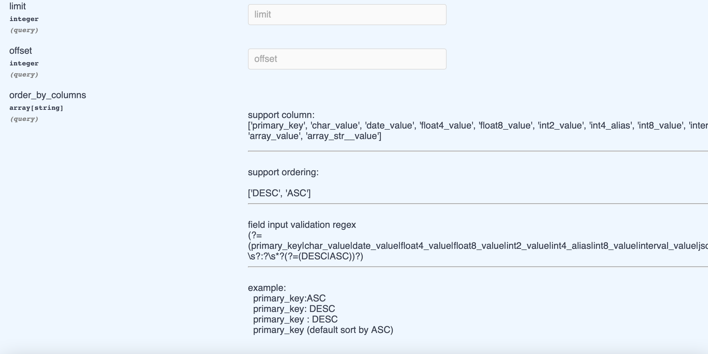

#  FastAPI Quick CRUD

FastAPI Quick CRUD 可以為你節省編寫重複的CRUD代碼，用戶只需要為你的Postgresql table編寫Sqlalchemy Declarative Base Class 便可立即生成該Table的 CRUD API。

#### FastAPI Quick CRUD支持生成以下API
- Get one
- Get many
- Update one
- Update many
- Patch one
- Patch many
- Create/Upsert one
- Create/Upsert many
- Delete One
- Delete Many
- Post Redirect Get




- 通過識別Column 的python 類型， FastAPI Quick CRUD 會生成以下的API 參數
  - string
    - 支持模糊搜索 
        - (<column_name>____str, <column_name>____str_____matching_pattern)
    - 支持 In-place搜索
        - (<column_name>____list, <column_name>____list____comparison_operator)
    

  - numeric 
    - 支持範圍搜索
        - (<column_name>____from, <column_name>____from_____comparison_operator)
        - (<column_name>____to, <column_name>____to_____comparison_operator)
    - 支持 In-place搜索
        - (<column_name>____list, <column_name>____list____comparison_operator)
    

  - datetime 
    - 支持範圍搜索
        - (<column_name>____from, <column_name>____from_____comparison_operator)
        - (<column_name>____to, <column_name>____to_____comparison_operator)
    - 支持 In-place搜索
        - (<column_name>____list, <column_name>____list____comparison_operator)
    

  - 分頁 
    - limit
    - offset
    - order by
    
  
      
- 模糊搜索
    可以參考: https://www.postgresql.org/docs/9.3/functions-matching.html
    - 你query 會變成以下SQL statment:
      - query:
        
        ```text
          /test_CRUD?
          char_value____str_____matching_pattern=match_regex_with_case_sensitive&
          char_value____str_____matching_pattern=does_not_match_regex_with_case_insensitive&
          char_value____str_____matching_pattern=case_sensitive&
          char_value____str_____matching_pattern=not_case_insensitive&
          char_value____str=a&
          char_value____str=b
          ```
      - sql
        ```sql
        SELECT *
        FROM untitled_table_256 
        WHERE (untitled_table_256.char_value ~ 'a') OR 
        (untitled_table_256.char_value ~ 'b' OR 
        (untitled_table_256.char_value !~* 'a') OR 
        (untitled_table_256.char_value !~* 'b' OR 
        untitled_table_256.char_value LIKE 'a' OR 
        untitled_table_256.char_value LIKE 'b' OR 
        untitled_table_256.char_value NOT ILIKE 'a' 
        OR untitled_table_256.char_value NOT ILIKE 'b'
        ```
      
- In-place 搜索
    - In-place 搜索支持以下圖中操作
    
  
    - query example
      - 如果用戶選擇Equal, 搜索True 和 False
```sql        
        select * FROM untitled_table_256 
        WHERE untitled_table_256.bool_value = true OR 
        untitled_table_256.bool_value = false
```     
        
- 範圍搜索
    - 範圍搜索支持以下圖中操作
    
  
    
  
  - sql is look like that
    ```sql
    select * from untitled_table_256
    WHERE untitled_table_256.date_value > %(date_value_1)s 
    ```
    ```sql
    select * from untitled_table_256
    WHERE untitled_table_256.date_value < %(date_value_1)s 
    ```

FastAPI Quick CRUD 亦支持為船router加入dependency

# 限制

- 如果該table有多個unique column, 請使用composite unique constraint 
- 請勿同一時間使用composite unique constraint 和 單獨一個unique，除非該單獨的unique constraint己存在於composite unique constraint中
    ```python
        class Example(Base):
            __tablename__ = 'example'
            __table_args__ = (
                UniqueConstraint('p_id', 'test'),
            )
        
            p_id = Column(Integer, primary_key=True, unique=True)
            test = Column(Integer, unique=True)
            test_1 = Column(Text)

        ```

- Primary key是必要的，但不支持 composite primary key
- Query Field 會是可選輸入的，如果該column 有default value 或 nullable
- Sqlalchemy 的server_default的value不會顯示在OPENAPI，請使用default
- Query Field 是必須輸入的，如果如果該column 沒有default value 和 不是nullable
- Query暫不支持以下的Postgresql 的數據類型:
    - INTERVAL
    - JSON
    - JSONB
    - H-STORE
    - ARRAY
    - BYTE
    - Geography
    - box
    - line
    - point
    - lseg
    - polygon
    - inet
    - macaddr

- 暫不支持Sqlalchemy 的 Automap() 


## Quick Use
```angular2html
pip install fastapi-quickcrud
```
1. Build a sample table with Sqlalchemy

    Strongly recommend you use `[sqlacodegen](https://pypi.org/project/sqlacodegen/)` to  generate the sql schema

    ```python
    from sqlalchemy import create_engine
    from sqlalchemy import *
    from sqlalchemy.dialects.postgresql import *
    from sqlalchemy.orm import *
   
    Base = declarative_base()
    metadata = Base.metadata
    engine = create_engine('postgresql://<user name>:<password>@<host>:<port>/<database name>', 
                            future=True, 
                            echo=True,
                            pool_use_lifo=True,
                            pool_pre_ping=True, 
                            pool_recycle=7200)

    class CRUDTest(Base):
        __tablename__ = 'crud_test'
        __table_args__ = (
            UniqueConstraint('id','float4_value', 'int4_value'),
        )

        id = Column(Integer, primary_key=True, server_default=text("nextval('untitled_table_256_id_seq'::regclass)"))
        bool_value = Column(Boolean, nullable=False, server_default=text("false"))
        bytea_value = Column(LargeBinary)
        char_value = Column(CHAR(10))
        date_value = Column(Date, server_default=text("now()"))
        float4_value = Column(Float, nullable=False)
        float8_value = Column(Float(53), nullable=False, server_default=text("10.10"))
        int2_value = Column(SmallInteger, nullable=False)
        int4_value = Column(Integer, nullable=False)
        int8_value = Column(BigInteger, default=99)
        interval_value = Column(INTERVAL)
        json_value = Column(JSON)
        jsonb_value = Column(JSONB(astext_type=Text()))
        numeric_value = Column(Numeric)
        text_value = Column(Text)
        time_value = Column(Time)
        timestamp_value = Column(DateTime)
        timestamptz_value = Column(DateTime(True))
        timetz_value = Column(Time(True))
        uuid_value = Column(UUID(as_uuid=True))
        varchar_value = Column(String)
        array_value = Column(ARRAY(Integer()))
        array_str__value = Column(ARRAY(String()))

    CRUDTest.__table__.create(engine)
    ```

2. prepare a database connection 

    ```python
    session = sessionmaker(autocommit=False, autoflush=False, bind=engine)
    def get_transaction_session():
        try:
            db = session()
            yield db
        finally:
            db.close()
    ```

3. import the required module

    ```python
    from fastapi_quickcrud import crud_router_builder
    from fastapi_quickcrud import CrudService
    from fastapi_quickcrud import CrudMethods
    from fastapi_quickcrud import sqlalchemy_to_pydantic
    ```

4. register CrudService  

    ```python
    test_crud_service = CrudService(model=CRUDTest)
    ```

5. convert the sqlalchemy model to Pydantic model

    ```python
    test_crud_model = sqlalchemy_to_pydantic(db_model = CRUDTest,
                                             crud_methods=[
                                                       CrudMethods.FIND_MANY,
                                                       CrudMethods.FIND_ONE,
                                                       CrudMethods.UPSERT_ONE,
                                                       CrudMethods.UPDATE_MANY,
                                                       CrudMethods.UPDATE_ONE,
                                                       CrudMethods.DELETE_ONE,
                                                       CrudMethods.DELETE_MANY,
                                                       CrudMethods.PATCH_MANY,
                                                       CrudMethods.PATCH_ONE,

                                               ],
                                             exclude_columns=[])

    ```

    - argument:
        - db_model: ```Sqlachemy Declarative Base Class```
        - async_mode: ```bool (default: False)```
          - 請設置True 如果使用async SQLALchemy(SQLALchemy 在1.4版本已通過greenlet實現async)
        - crud_methods: ```CrudMethods```
            - examples
              - CrudMethods.FIND_ONE
              - CrudMethods.FIND_MANY
              - CrudMethods.UPDATE_ONE
              - CrudMethods.UPDATE_MANY
              - CrudMethods.PATCH_ONE
              - CrudMethods.PATCH_MANY
              - CrudMethods.UPSERT_ONE
              - CrudMethods.UPSERT_MANY
              - CrudMethods.DELETE_ONE
              - CrudMethods.DELETE_MANY
              - CrudMethods.POST_REDIRECT_GET

        - exclude_columns: set the columns that not to be operated but the columns should nullable or set the default value)

6. user CrudRouter to register API

    - db_session: `get_transaction_session`

    - crud_service: `CrudService`

    - crud_models: `sqlalchemy_to_pydantic` 

    - prefix, tags: extra argument for include_router() of APIRouter() of fastapi

    ```python
    	new_route_3 = crud_router(db_session=get_transaction_session,
                                  crud_service=UntitledTable256_service,
                                  crud_models=test_crud_model,
                                  prefix="/crud_test",
                                  dependencies = [],
                                  tags=["Example"]
                                  )
    ```

# Alias

Alias is supported already

usage:

```python
id = Column('primary_key',Integer, primary_key=True, server_default=text("nextval('untitled_table_256_id_seq'::regclass)"))
```

you can use info argument to set the alias name of column, 
and use synonym to map the column between alias column and original column

```python
id = Column(Integer, info={'alias_name': 'primary_key'}, primary_key=True, server_default=text("nextval('untitled_table_256_id_seq'::regclass)"))
primary_key = synonym('id')
```
